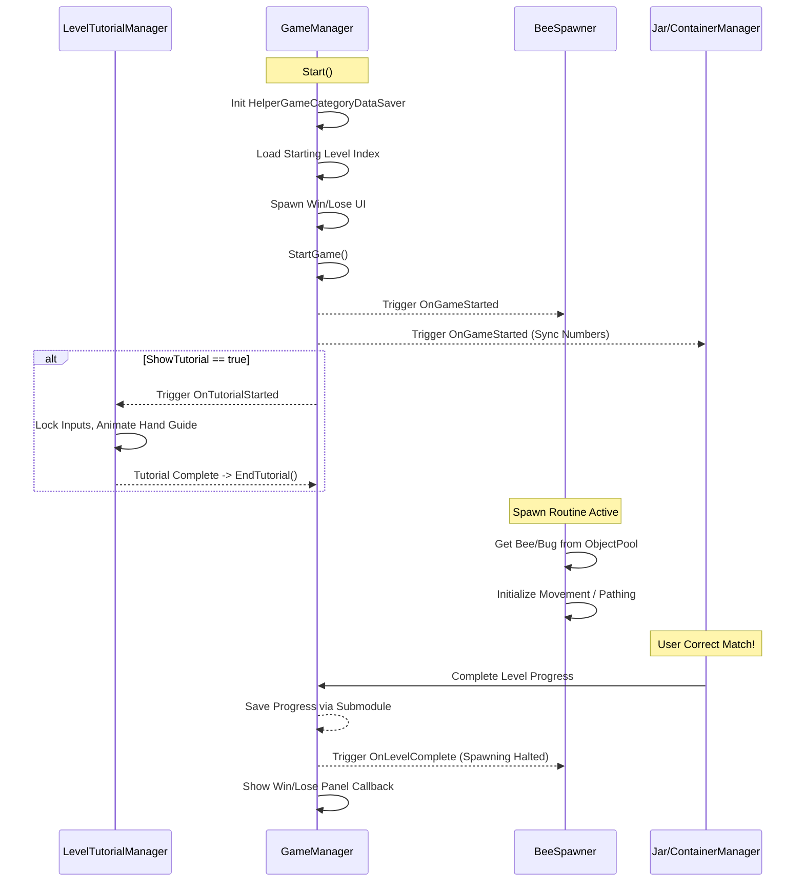

# 🎮 Playschool Minigame: Counting 1 to 100

Welcome to the **Counting 1 to 100** Unity project. This minigame is a core part of the **Playschool** gaming suite. It is designed to teach children counting through interactive visual association, number enunciations, and matching mechanics.

---

## 🗺️ Codebase Map & Key Entry Points

If you are a developer (or an AI assistant like Claude) navigating this repository for the first time, use this map to find where key systems reside:

| Script / Asset | Project Path | Role & Architecture Impact |
| :--- | :--- | :--- |
| **`BundleTestandLoad.cs`** | `Assets/BundleTestandLoad.cs` | **Main Loader:** Handles orientation settings, fetches saved data from API, loads the gameplay scene from the AssetBundle, and manages category buttons. |
| **`RuntimeAudioLoader.cs`** | `Assets/RuntimeAudioLoader.cs` | **Audio Engine:** Handles downloading, extracting, and loading language-specific voiceovers (`.mp3` files) dynamically from CloudFront CDN. |
| **`GameManager.cs`** | `Assets/_Counting1To100/Scripts/GameManager.cs` | **State Orchestrator:** Manages the game flow, current level ranges (1-10, 11-20, etc.), event triggers, and communicates progress to the submodule API. |
| **`LevelData.cs`** | `Assets/_Counting1To100/Scripts/LevelData.cs` | **Config Layer:** ScriptableObject defining range limits, prefab assets (insects, containers), background sprites, and tutorial configurations. |
| **`BeeSpawner.cs`** | `Assets/_Counting1To100/Scripts/BeeSpawner.cs` | **Object Pool:** Manages the spawning logic of numbered insects using Unity's `UnityEngine.Pool` API to avoid garbage collection spikes. |
| **`BeeController.cs`** | `Assets/_Counting1To100/Scripts/BeeController.cs` | **Insect Behavior:** Controls flying/hovering, Sinusoidal/Perlin-noise bobbing, antenna/wing animations, click detection, and jar entry/exit tweens. |
| **`BugController.cs`** | `Assets/_Counting1To100/Scripts/DragAndDropMode/BugController.cs` | **Draggable Insect:** Extends interaction to drag-and-drop operations (implements `IBeginDragHandler`, `IDragHandler`, `IEndDragHandler`). |
| **`JarController.cs`** | `Assets/_Counting1To100/Scripts/JarController.cs` | **Standard Target:** Handles target number display, correct/incorrect drop evaluation, and idle wandering loops of captured fireflies. |
| **`FlowerContainerController.cs`** | `Assets/_Counting1To100/Scripts/DragAndDropMode/FlowerContainerController.cs` | **Drag Container:** Standard drop target script in drag-and-drop mode, implementing visual pulse/particles feedback upon correct drops. |
| **`LevelTutorialManager.cs`** | `Assets/_Counting1To100/Scripts/LevelTutorialManager.cs` | **Tutorial/Hint System:** Guides young players using a dark overlay, hand swipe path animations, and schedules idle hints after `5s` of inactivity. |
| **`AudioManager.cs`** | `Assets/_Counting1To100/Scripts/AudioManager.cs` | **Audio Mapper:** Standardizes game events (correct, level complete) and maps them to dynamic clip names inside `RuntimeAudioLoader`. |

---

## 🔄 Event-Driven Architecture & Gameplay Lifecycle
The game mechanics are decoupled using C# events to prevent tight coupling between managers and gameplay actors:



### Event Definitions
*   `OnSceneLoaded`: Fired when the dynamic scene loads. Used to initialize canvases and trigger background music.
*   `OnGameStarted`: Activates spawning, synchronizes numbers, and plays introductory sound mappings.
*   `OnLevelComplete`: Halts spawners, triggers level-completion audio, and invokes the Win/Lose panel.
*   `OnNextLevel`: Advances the index to fetch the next `LevelData` Configuration.
*   `OnGameEnded`: Fired when the final level is cleared, initiating the terminal minigame exit flow.

### 🔌 Event Binding & Inspector Connections
*   **Programmatic Binding (Preferred):** To ensure code searchability and avoid hidden scene dependencies, all critical buttons in this project are wired **programmatically** in code rather than using Inspector-configured UnityEvents.
    *   *Examples:* `_playButton.onClick.AddListener(OnPlayClicked)` in `UIManager.cs` and button clicks in `WinLosePanelScript.cs`.
*   **Pointer Interfaces:** User interactions on the insects (`BeeController` / `BugController`) are driven by Unity EventSystem interfaces (`IPointerClickHandler`, `IBeginDragHandler`, `IDragHandler`, `IEndDragHandler`) rather than Inspector triggers.
*   *Audit Tip:* If you are maintaining other projects in this suite, you can scan for Inspector-wired methods by searching scene/prefab files for the `m_MethodName:` property.

---

## 🗂️ Scene & AssetBundle Configuration

### 1. Loader Scene: `PlayschoolMainScene.unity` (`Assets/Scenes/PlayschoolMainScene.unity`)
*   **Purpose:** The entry point scene that is bundled into the host application build settings.
*   **Key GameObjects:**
    *   `RuntimeAudioLoader`: Holds `RuntimeAudioLoader.cs` which persists across scene loads to stream localized voiceovers.
    *   `BundleLoader`: Holds `BundleTestandLoad.cs`, managing dynamic category UI cards and AssetBundle scenes.

### 2. Gameplay Scene: `NEW_Count1To100.unity` (`Assets/_Counting1To100/Scenes/NEW_Count1To100.unity`)
*   **AssetBundle Name:** `counting100`
*   **Output Path:** Packed inside `Assets/StreamingAssets/android/counting100` (for Android players) or `Assets/StreamingAssets/counting100` (for iOS/PC players).
*   **Key GameObjects:**
    *   `GameManager`: Integrates `GameManager.cs` to control gameplay states.
    *   `Canvas/GamePanel`: Houses the UI structure.
    *   `BeeSpawners`/`DirectionalBugSpawner`: Manages spawning locations.
    *   `JarsHolder`/`ContainerManager`: Organizes drop target locations.
    *   `LevelTutorialManager`: Runs tutorial overlays and pointer scripts.

---

## 🛠️ Build Pipeline & Compilation
AssetBundles are built locally in the Unity Editor and stored under `StreamingAssets` before building players.

### Standalone Editor Compiler Script
To compile AssetBundles directly, create this script at `Assets/_Counting1To100/Scripts/Editor/BuildAssetBundles.cs`:
```csharp
#if UNITY_EDITOR
using UnityEditor;
using System.IO;

public class BuildAssetBundles
{
    [MenuItem("Counting1to100/Build AssetBundles")]
    public static void BuildAllAssetBundles()
    {
        string assetBundleDirectory = "Assets/StreamingAssets";
        if (!Directory.Exists(assetBundleDirectory))
        {
            Directory.CreateDirectory(assetBundleDirectory);
        }
        
        // Compile for Android
        BuildPipeline.BuildAssetBundles(
            Path.Combine(assetBundleDirectory, "android"), 
            BuildAssetBundleOptions.None, 
            BuildTarget.Android
        );
        
        // Compile for iOS
        BuildPipeline.BuildAssetBundles(
            Path.Combine(assetBundleDirectory, "ios"), 
            BuildAssetBundleOptions.None, 
            BuildTarget.iOS
        );
        
        AssetDatabase.Refresh();
    }
}
#endif
```
*   **Execute Compiler:** Go to the Editor menu bar -> **Counting1to100** -> **Build AssetBundles**.
*   **Output:** Assets are automatically outputted to `Assets/StreamingAssets/android` and `Assets/StreamingAssets/ios`.

---

## 🔗 Git Submodule Data Layer Integration
The minigame relies on a shared database module called `PlaySchoolAPI` linked as a Git Submodule.

*   **Submodule URL:** `https://github.com/TopG-Neela-mediatech/PlaySchoolAPI_main`
*   **Local Project Folder:** [PlaySchoolAPI](file:///d:/Unity_Projects/Counting1to100/Assets/PlaySchoolAPI)

### 💾 Data Saver API Contract
The minigame communicates with this data layer using the `HelperGameCategoryDataSaver` class:
*   `HelperGameCategoryDataSaver.Init(int maxLevels)`: Initializes the database instance with the number of levels.
*   `HelperGameCategoryDataSaver.GetStartLevel()`: Retrieves the player's current level index so they resume where they left off.
*   `HelperGameCategoryDataSaver.LevelCompleted(int nextLevelNumber)`: Commits progress to the persistent database (levels completed, attempts, scores, time spent).
*   `UpdateCategoryApiManager.LoadAllGamePlayData()`: Retrieves previous session metrics (`RecentGameData` model) to display stats on category buttons inside the main menu.

---

## ⚙️ Setup & Troubleshooting Guide

### 🚀 Developer Setup
1.  **Clone recursively to pull the Submodule:**
    ```bash
    git clone --recursive https://github.com/TopG-Neela-mediatech/Counting1to100.git
    ```
2.  **Restore Submodules (if cloned normally):**
    ```bash
    git submodule update --init --recursive
    ```
3.  **Compile Assets:**
    *   Open the project in Unity Editor.
    *   Click **Counting1to100** -> **Build AssetBundles**.
    *   Verify compiled files in `Assets/StreamingAssets/`.

### ⚡ Mobile Optimizations
*   **Garbage Collection Prevention:** Built-in `ObjectPool<BeeController>` avoids runtime instantiation memory overhead.
*   **Physics Bypass:** Gameplay logic uses kinematic rigidbodies and DOTween animations (scaling, dropping, bobbing) instead of continuous physics simulations.
*   **Audio Memory Management:** `RuntimeAudioLoader` streams `.mp3` files as local file URLs rather than pre-loading heavy audio assets into the build, and deletes temporary download archives.

### 🎨 Fixing Pink/Missing Shaders (URP Conversion)
If materials appear neon pink due to legacy shader compatibility issues:
1.  Go to **Window** -> **Rendering** -> **Render Pipeline Converter**.
2.  In the converter window, check **Material Upgrade**.
3.  Click **Initialize Converters**, then click **Convert Assets**.
4.  If assets fail to convert, manually select their materials and change the shader to `Universal Render Pipeline/2D/Sprite-Lit` or `Universal Render Pipeline/2D/Sprite-Unlit`.

---

## 🤖 Instructions for AI Maintainers (e.g. Claude, ChatGPT)
When modifying, debugging, or adding features to this repository, keep these rules in mind:

### 1. Adding a New Level
*   Do not hardcode numbers or levels. Instead, create a new `LevelData` ScriptableObject instance:
    1. Right-click in Project view -> **Create** -> **TMKOC.Counting100** -> **LevelData**.
    2. Define `LevelMin` and `LevelMax` values.
    3. Link the container prefab, bug prefab variants, background sprite, and select whether to enable `ShowTutorial`.
    4. Register this asset inside the `_levels` list of the `GameManager` component in `NEW_Count1To100.unity`.

### 2. Modifying Voiceovers
*   Sound keys must match the pattern: `OnLevelStart{index}` and `{number}.0`.
*   If changing voiceover clips, ensure the files are generated as `.mp3` format and uploaded to the CloudFront CDN subfolder matching `CurrentCategoryName`.
*   The `RuntimeAudioLoader` will download, extract, and map them to their corresponding keys at runtime.

### 3. Debugging Drag & Drop Mechanics
*   If drag-and-drop objects fail to snap, verify the target canvas has a GraphicRaycaster component.
*   Ensure that draggables implement `IBeginDragHandler`, `IDragHandler`, and `IEndDragHandler`, and that they cast a ray to find the nearest `IDragContainer` using `ContainerManager.Instance`.
